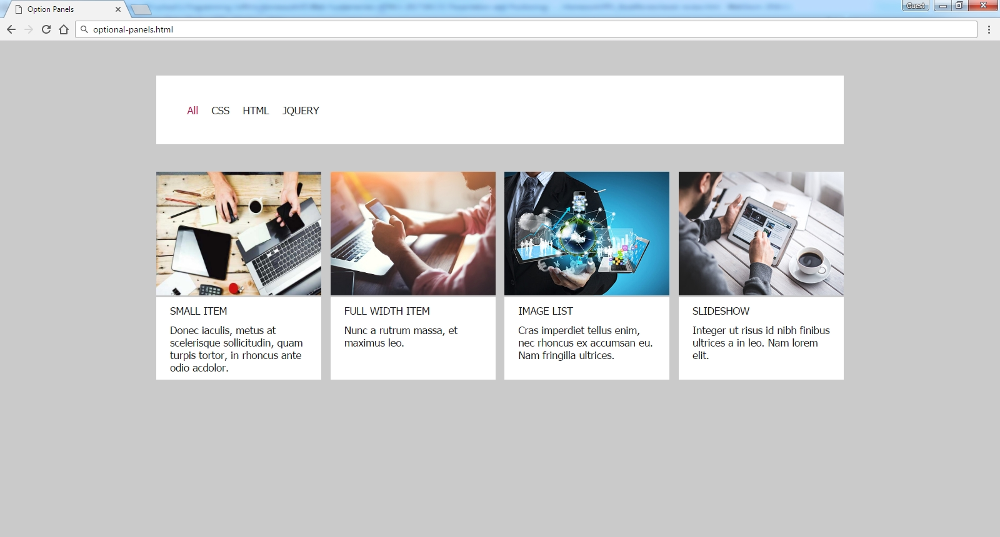
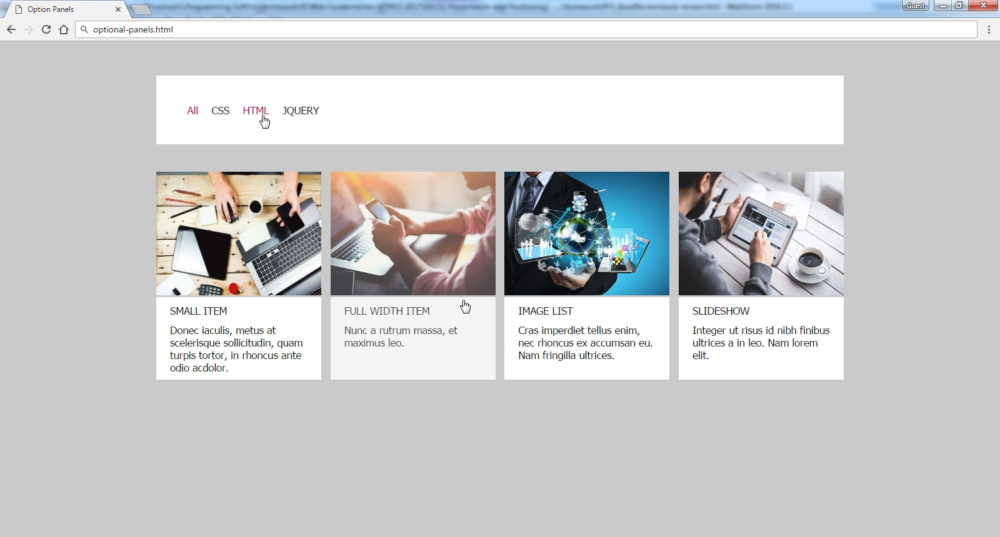

# OptionPanels
Create a Web page (HTML5 + CSS3 + images) that looks and behaves like the screenshots below: 

* The mouse cursors in the above screenshots explain what happens when the mouse moves over a project or a group and when the browser window resizes.
